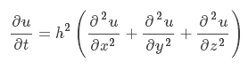

# Hexo Filter MathJax

[](https://npmjs.org/package/hexo-filter-mathjax)
[](https://npmjs.org/package/hexo-filter-mathjax)
[](https://npmjs.org/package/hexo-filter-mathjax)
[](https://npmjs.org/package/hexo-filter-mathjax)

**MathJax Renderer Plugin for Hexo**.  
Add support of [MathJax](http://www.mathjax.org/) for [Hexo](http://hexo.io/).

## INSTALL
```bash
$ npm install hexo-filter-mathjax --save
```
Edit `_config.yml`:
```yaml
plugins:
  - hexo-filter-mathjax
```
## Sample

Write the following latex code:
```
$$
\frac{\partial u}{\partial t} = h^2 \left( \frac{\partial^2 u}{\partial x^2} + \frac{\partial^2 u}{\partial y^2} + \frac{\partial^2 u}{\partial z^2}\right)
$$
```
Then you will get:


